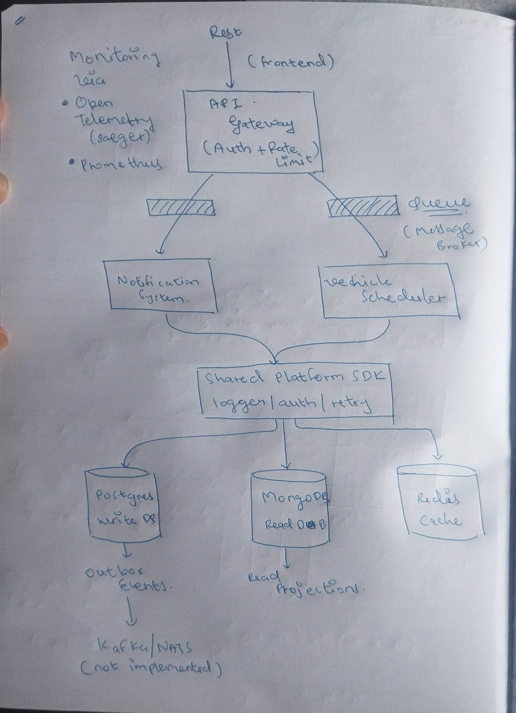
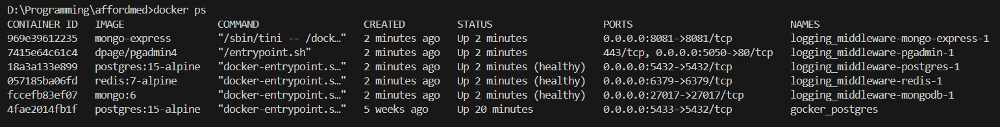
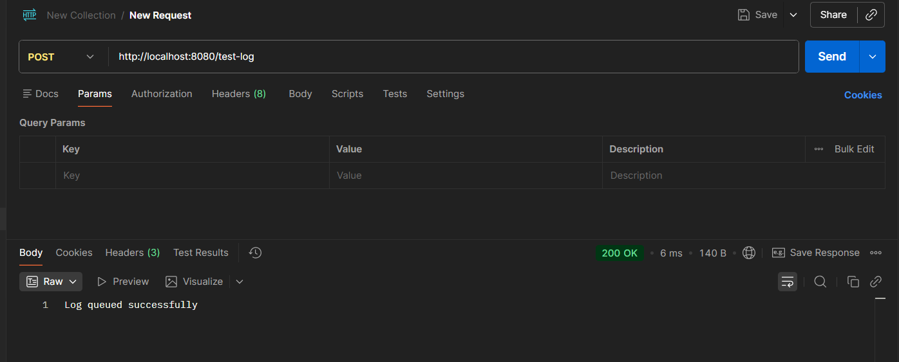
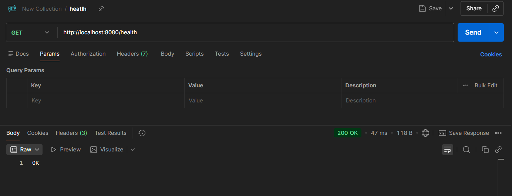

# Logging Middleware Platform SDK

A production-ready foundation and SDK providing vertical slice event logging, robust authentication, caching, and worker pools designed for event-driven systems.

## Architecture

This module implements a reusable platform SDK to be consumed by downstream business services:
- **`pkg/auth`**: A resilient token manager that seamlessly injects Bearer tokens, retries on 401s, and manages a background preemptive refresh loop via `sync.RWMutex` cache.
- **`pkg/config`**: A strictly validated, fail-fast configuration loader built over `cleanenv`.
- **`pkg/logger`**: The core asynchronous structured logging client.
- **`pkg/worker`**: A flexible concurrency pool implementation with exponential backoff for background API shipments.

## Usage

This module is designed to be included in a Go workspace (`go.work`). Downstream services can import packages directly:

```go
import "logging_middleware/pkg/auth"
```

### Local Development

1. Duplicate `.env.example` to `.env`
2. Start the infrastructure:
   ```bash
   docker compose up -d
   ```
3. Run the API locally:
   ```bash
   make run-api
   ```

## Screenshots





